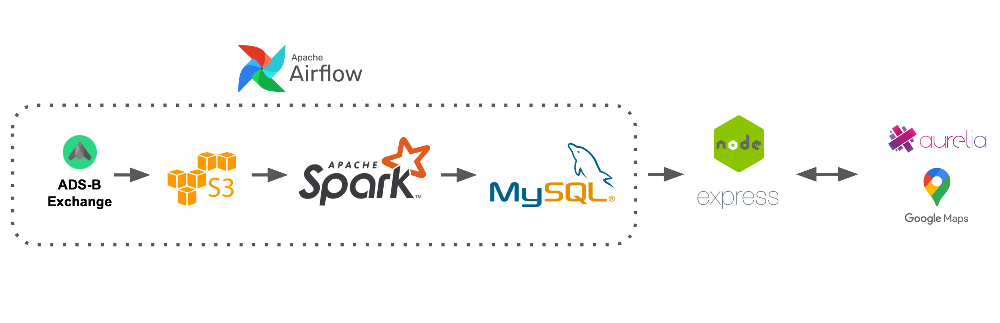

# Close Calls

Close Calls is a batching pipeline built to analyze historical flight data and display flights that were very close.

Slides - [Google Slides](https://docs.google.com/presentation/d/1HkhyJk-61REsz5vFL9xPAtWcW4X4OVPTBDgzpofDDgc/)

Live Demo - [datasite.xyz](datasite.xyz)

## Installation

Close Calls requires Spark running on a distributed cluster. To run the Spark job, use `RunSpark.sh <YYYY-MM-DD>`, with the command line argument the date of the data you want to process. 

To install the frontend application, set up a server with MySql and Node. Then `npm i` and run the Aurelia frontend with `au run`.

## Architecture

Raw data comes from the adsbexchange.com sample dataset, available at https://history.adsbexchange.com/downloads/samples/. Airflow is configured to download the sample data to an EC2 instance, unzip it, and upload to S3. From there, a Spark batching job writes the data to a MySql server, and the frontend is served from Node/Express.

## Dataset

The data is organized by day, and is broken into 1440 files (one per minute). Each minute of data is about 70 MB and 70,000 lines. 

## Engineering challenges

The biggest engineering challenge was finding an efficient way to detect close calls. 
