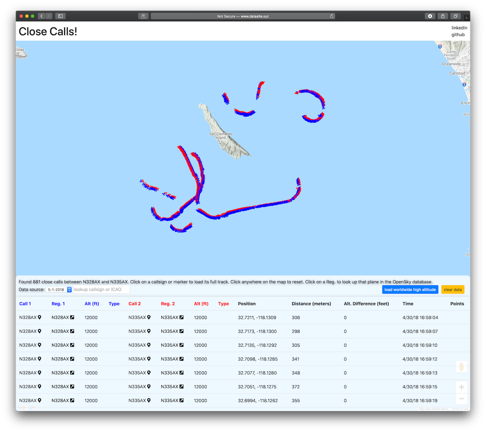

# `Close Calls Aurelia App`

This project is bootstrapped by [aurelia-cli](https://github.com/aurelia/cli).
For more information, go to https://aurelia.io/docs/cli/webpack

## Run dev app

Run `npm start`, then open `http://localhost:8080`

The MySQL server must also be running. To allow the app to talk to MySQL, create a `mysql-config.js` file in this directory containing the following: 

    module.exports = {
        username: 'USERNAME',
        password: 'PASSWORD'
    }

## Run for production

[Install PM2](https://pm2.keymetrics.io). Then, `pm2 start aurelia -- run`. This will start the server running on port 8080. To forward to port 80, I used nginx. Edit the nginx config file to proxy to port 80: 

    server {
        ...
        location / {
            proxy_pass http://127.0.0.1:8080;
        }
        ...
    }

